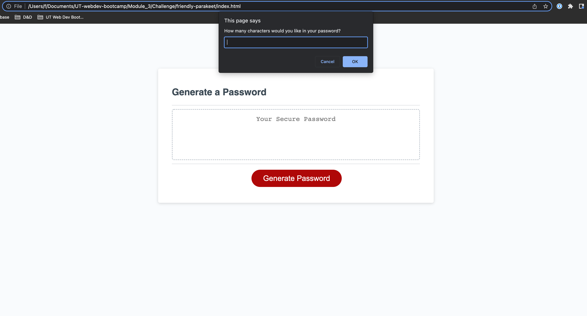

# <Password-Generator>

## Javascript Password Generator

Goal: Utilize Javascript to design a password generator

## Actions:

When generate password button is clicked user is given prompts for password selection criteria
Prompts include: select password length from 8-128 characters; select characters: symbols, uppercase alpha, lowercase alpha, numbers
Validate the input selection is at minimum one character type
Once prompts have been selected the password generated meets the users selected criteria displayed in the password box

## Demo

https://fightingwards.github.io/password_generator/

## Credits

UT Web Development Bootcamp

## License

MIT License

Copyright (c) [2022] [fightingwards]

Permission is hereby granted, free of charge, to any person obtaining a copy of this software and associated documentation files (the "Software"), to deal in the Software without restriction, including without limitation the rights to use, copy, modify, merge, publish, distribute, sublicense, and/or sell copies of the Software, and to permit persons to whom the Software is furnished to do so, subject to the following conditions:

The above copyright notice and this permission notice shall be included in all copies or substantial portions of the Software.

THE SOFTWARE IS PROVIDED "AS IS", WITHOUT WARRANTY OF ANY KIND, EXPRESS OR IMPLIED, INCLUDING BUT NOT LIMITED TO THE WARRANTIES OF MERCHANTABILITY, FITNESS FOR A PARTICULAR PURPOSE AND NONINFRINGEMENT. IN NO EVENT SHALL THE AUTHORS OR COPYRIGHT HOLDERS BE LIABLE FOR ANY CLAIM, DAMAGES OR OTHER LIABILITY, WHETHER IN AN ACTION OF CONTRACT, TORT OR OTHERWISE, ARISING FROM, OUT OF OR IN CONNECTION WITH THE SOFTWARE OR THE USE OR OTHER DEALINGS IN THE SOFTWARE.
